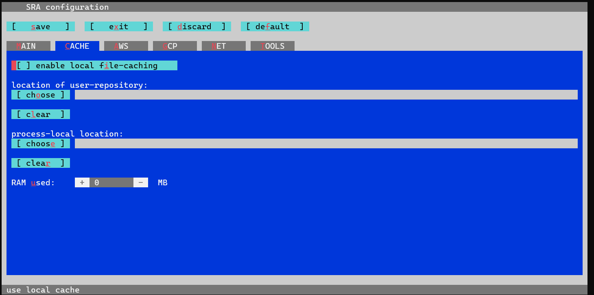

# Contenido:

- [Practica 1 - Analisis de calidad de las lecturas y limpieza de adaptadores](#practica1) - 21-22 Feb 2023
- [Practica 2 - Ensamblaje con el transcriptoma de referencia (kallisto)](#practica2) - 22 Feb 2023
- [Practica 3 - Expresión diferencial con DESeq2](#practica3) - 23 Feb 2023
- [Practica 4 - Expresión diferencial con edgeR](#practica4) - 24 Feb 2023
- [Practica 5 - Análisis de terminos GO](#practica5) - 24 Feb 2023

## Practica 1 - Analisis de calidad de las lecturas y limpieza de adaptadores  <a name="practica1"></a>

### 1) Analisis de calidad de las lecturas crudas (raw data)

```
screen -S SRAdata # guardar una sesion en screen

# Nota para screen:
# - screen -S nombre : Guardar tu sesion actual
# - screen -ls : Ver el ID de tus sesiones
# - screen -r ID : cargar tu sesion de screen 
# - Ctrl + a + d : Salir del screen
# - Ctrl + a + esc : scroll

qlogin
cd /mnt/Timina/bioinfoII/rnaseq/BioProject_2023/rawData
ls
```

```
Desgloce de carpetas:
|-Athaliana_Fe_def/           # PRJNA256121 ---> Proyecto 1
|-Athaliana_phosphate/        # PRJNA821620 ---> Proyecto 2
|-COVID_virus/                # PRJNA858106 ---> Proyecto 3
|-Homo_sapiens/               # PRJNA826506 ---> Proyecto 4
|-adapters
    |- TruSeq3-PE.fa          # adaptadores para paired-end
    |- TruSeq-SE.fa           # adaptadores para single-end
    |- readme.txt
|-SRAData_dow.sh              # Descarga de SRA
|-SRA_run.sge                 # Mandar como job al cluster
```

### Error 1

Para descargar achivos por cada USUARIO debes modificar lo siguiente:

```
module load sra/3.0.0
vdb-config -i # disable storage of cache in ~
```
Va a desplegar la siguiente pantalla, te puedes mover con las letras que salen ahi. 
1 ) Teclamos C, para ir **C**ACHE
2 ) Deshabilitamos [] enable local file-caching, tecleando i
3 ) Vamos a guardar el cambio, tecleando s
4 ) teclea o, de OK
5 ) para salir tecleamos x.



Este paso es basico e indispensable para que puedas usar las herramientas de SRA tools (modulo sra/3.0.0).

### Error 2

Cada usuario tiene permisos diferentes cuando crea un archivo. Los permisos pueden modificarse con *chmod*.

Los caracteres atribuidos a los permisos son:
- *r* : escritura (Read)
- *w* : lectura (Write)
- *x* : ejecución (eXecute)

|  permisos   |  pertenece  |
|-------------|-------------|
|  rwx------  | usuario     |
|  ---r-x---  | grupo       |
|  ------r-x  | otros       |


La representación octal de chmod es muy sencilla

- Lectura tiene el valor de 4
- Escritura tiene el valor de 2
- Ejecución tiene el valor de 1

|  permisos| valor | significado |
|-----|-----|-----------------------------------|
| rwx |  7  | Lectura, escritura y ejecución    |
| rw- |  6  | Lectura, escritura        |
| r-x |  5  | Lectura y ejecución       |
| r-- |  4  | Lectura               |
| -wx |  3  | Escritura y ejecución             |
| -w- |  2  | Escritura                         |
| --x |  1  | Ejecución             |
| --- |  0  | Sin permisos          |

Por lo tanto:

| Forma larga |  Forma Octal |
|------------------------|-----------|
|chmod u=rwx,g=rwx,o=rx  | chmod 775 | 
|chmod u=rwx,g=rx,o=     | chmod 760 |
|chmod u=rw,g=r,o=r      | chmod 644 |
|chmod u=rw,g=r,o=       | chmod 640 |
|chmod u=rw,go=          | chmod 600 |
|chmod u=rwx,go=         | chmod 700 |
x------------------------x-----------x

Como no estamos en nigun grupos, todos estamos en "otros", recomiendo que cambien todo lo que generen con:

```
chmod 777 Archivo
```

### TAREA:

- 1) Copiar lo archivos SRAData_dow.sh y SRA_run.sge en tu carpeta (proyecto).

```
# /mnt/Timina/bioinfoII/rnaseq/BioProject_2023/rawData
cp SRAData_dow.sh  Athaliana_Fe_def
cp SRA_run.sge Athaliana_Fe_def
```

- 2) Editar el archivo TXT contenido en tu carpeta, agrega cada SRA que falta de tu PRJNA (bioProject). *TIP:* cada SRA va en cada renglon.

```
cd Athaliana_Fe_def

# Si vemos que contiene el archivo TX, vemos que solo hay 2 SRA
cat ./Athaliana_Fe_def/Athaliana_fastq.txt
SRR1524946
SRR1524938

# Falta agregar los demas en cada linea o reglon.
nano Athaliana_fastq.txt
```

- 3) Edita el archivo.sh para que se ejecute en tu carpeta y guarde la informacion. Ejemplo de como debe quedar el codigo:

```
cat SRA_Hs_dow.sh
# Descarga de datos
# PARTE 1.- Descargar SRA
# PARTE 2.- Cambio de SRA a Fastq
# USAGE= ./SRA_Hs_dow.sh
# sed -i 's/\r//' ./SRA_Hs_dow.sh

# AUTHOR: Evelia Lorena Coss Navarrete
# https://github.com/EveliaCoss

# Tip: Cambia las direcciones para cada proyecto

# PARTE 1.- Descargar SRA
prefetch --option-file ./human_fastq.txt -O ./data

# --option-file : archivo de entrada con cada SRA por renglon
# -O : salida

# PARTE 2.- Cambio de SRA a Fastq
fastq-dump --gzip --skip-technical --dumpbase --split-3 --clip --outdir ./data/ ./data/SRR*/*.sra

# --gzip : Descomprimir archivos comprimidos con .gz
# --skip-technical : Optener solo lecturas de cada replica biologica. No tecnicas.
# --dumpbase : Formato de las secuencias basada en espacios.
# --split-3 : Separar archivos dependiendo del SRA en single-end con *.fastq, si es paired-end con *_1.fastq y *_2.fastq
# --clip : Remover adaptadores de las lecturas
# --outdir : salida
```

- 4) Edita el archivo.sge para que puedas mandar el job de acuerdo a lo que necesitas.

```
cat SRA_Hs_run.sge
#!/bin/bash
#
# Use Current working directory
#$ -cwd
#
# Join stdout and stderr
#$ -j n
#
# Run job through bash shell
#$ -S /bin/bash
#
# You can edit the script since this line
#
# Your job name
#$ -N Hs2RawData
#
# Send an email after the job has finished
#$ -m e
#$ -M ccc@gmail.com
#
#
# If modules are needed, source modules environment (Do not delete the next line):
. /etc/profile.d/modules.sh
#
# Add any modules you might require:
module load sra/3.0.0
#
# Write your commands in the next line
./SRA_Hs_dow.sh
```

Agrega tu email para que te avise cuando termine: #$ -M ccc@gmail.com

NOTA: necesitas mas modulos debes agregarlos en el archivo.sge, si cambias el script tambien debes editar ese archivo.

- 5) Descarga los archivos SRA.

```
# no este en qlogin, tienes que estar en root
qsub SRA_Hs_run.sge
```

### Continuamos con la practica 

Vamos a hacer buenas practicas de bioinformatica, acomoda tu proyecto de la siguiente manera:

```
|-Athaliana_Fe_def/           # PRJNA256121
  |- data/                    # raw_data (fastq.gz)
  |- FastQC_rawData/              # Salida del analisis de FastQC
  
 # Tipo: mkdir FastQC_rawData
```

Posteriormente, vamos a iniciar el analisis de calidad de las lecturas crudas o sin procesar (raw data):

```
# ejemplo:
cd /mnt/Timina/bioinfoII/rnaseq/BioProject_2023/examples_class/At_BlueDark_example

# cargar module FastQC
qlogin
module load fastqc/0.11.3
fastqc ./data/*.fastq.gz -o ./FastQC_rawData
```

Para el reporte en MultiQC:

```
module load multiqc/1.5
multiqc ./FastQC_rawData
```

### 2) Limpieza de adaptadores

```
module load trimmomatic/0.33
mkdir data_trimmed

# Crear symlink
ln -s /mnt/Timina/bioinfoII/rnaseq/BioProject_2023/rawData/adapters/TruSeq3-PE.fa .
ln -s /mnt/Timina/bioinfoII/rnaseq/BioProject_2023/rawData/adapters/TruSeq-SE.fa .

# single-end
cd data
for i in *.fastq.gz;
do echo
trimmomatic SE -threads 2 -phred33 $i ../data_trimmed/"${i%.fastq}_trimmed.fq.gz" ILLUMINACLIP:../TruSeq-SE.fa:2:30:10 LEADING:3 TRAILING:3 SLIDINGWINDOW:4:20 MINLEN:35
done

# paired-end
cd data
for i in *_1.fastq.gz;
do echo
trimmomatic PE -threads 8 -phred33 $i "${i%_1.fastq.gz}_2.fastq.gz" \
../data_trimmed/"${i%_1.fastq.gz}_1_trimmed.fastq.gz" ../data_trimmed/"${i%_1.fastq.gz}_1_unpaired.fastq.gz" \
../data_trimmed/"${i%_1.fastq.gz}_2_trimmed.fastq.gz" ../data_trimmed/"${i%_1.fastq.gz}_2_unpaired.fastq.gz" \
ILLUMINACLIP:../TruSeq3-PE.fa:2:30:10 LEADING:3 TRAILING:3 SLIDINGWINDOW:5:20 MINLEN:60
done

# Regresar
cd ../
```

Notas:

- Remove adapters (ILLUMINACLIP:TruSeq3-PE.fa:2:30:10)
- Remove leading low quality or N bases (below quality 3) (LEADING:3)
- Remove trailing low quality or N bases (below quality 3) (TRAILING:3)
- Scan the read with a 4-base wide sliding window, cutting when the average quality per base drops below 15 (SLIDINGWINDOW:4:15)
- Drop reads below the 36 bases long (MINLEN:36)

Description:

- ILLUMINACLIP: Cut adapter and other illumina-specific sequences from the read.
- SLIDINGWINDOW: Perform a sliding window trimming, cutting once the average quality within the window falls below a threshold.
- LEADING: Cut bases off the start of a read, if below a threshold quality
- TRAILING: Cut bases off the end of a read, if below a threshold quality
- CROP: Cut the read to a specified length
- HEADCROP: Cut the specified number of bases from the start of the read
- MINLEN: Drop the read if it is below a specified length
- TOPHRED33: Convert quality scores to Phred-33
- TOPHRED64: Convert quality scores to Phred-64

Nota = ASCII_33 contiene los simbolos # y $ mientras que ASCII_64 no los contiene.

### 3) Analisis de calidad de las lecturas sin adaptadores

```
mkdir FastQC_trimmed
fastqc ./data_trimmed/*.fastq.gz -o ./FastQC_trimmed

# Reporte en MultiQC
multiqc ./FastQC_trimmed
```

### 4) Descarga de los archivos en tu computadora

```
rsync -rptuvl ecoss@dna.liigh.unam.mx:/mnt/Timina/bioinfoII/rnaseq/examples_class/At_BlueDark_example/COVID_virus/data/multiqc_report.html . 
```

### 5) Mandar todo en un job

Necesitas un sh y un sge

Ejemplo:  FastQCTrimmed_dow.sh

```
#!/bin/bash

# USAGE= ./FastQCTrimmed_dow.sh
# sed -i 's/\r//' FastQCTrimmed_dow.sh

# AUTHOR: Evelia Lorena Coss Navarrete
# https://github.com/EveliaCoss

# /mnt/Citosina/amedina/ecoss/Class/data/rawData_fastq

# PARTE 1.- FastQC y multiQC
fastqc ./data/*.fastq.gz -o ./FastQC_rawData
multiqc ./FastQC_rawData

# PARTE 2.- Limpieza de adaptadores
# single-end
cd data
for i in *.fastq.gz;
do echo
trimmomatic SE -threads 2 -phred33 $i ../data_trimmed/"${i%.fastq}_trimmed.fq.gz" ILLUMINACLIP:../TruSeq-SE.fa:2:30:10 LEADING:3 TRAILING:3 SLIDINGWINDOW:4:20 MINLEN:35
done

# PARTE 3.- FastQC y multiQC
fastqc ./data_trimmed/*.fastq.gz -o ./FastQC_trimmed
# Reporte en MultiQC
multiqc ./FastQC_trimmed#!/bin/bash

# USAGE= ./FastQCTrimmed_dow.sh
# sed -i 's/\r//' FastQCTrimmed_dow.sh

# AUTHOR: Evelia Lorena Coss Navarrete
# https://github.com/EveliaCoss

# /mnt/Citosina/amedina/ecoss/Class/data/rawData_fastq

# PARTE 1.- FastQC y multiQC
fastqc ./data/*.fastq.gz -o ./FastQC_rawData
multiqc ./FastQC_rawData

# PARTE 2.- Limpieza de adaptadores
# single-end
cd data
for i in *.fastq.gz;
do echo
trimmomatic SE -threads 2 -phred33 $i ../data_trimmed/"${i%.fastq}_trimmed.fq.gz" ILLUMINACLIP:../TruSeq-SE.fa:2:30:10 LEADING:3 TRAILING:3 SLIDINGWINDOW:4:20 MINLEN:35
done

# PARTE 3.- FastQC y multiQC
fastqc ./data_trimmed/*.fastq.gz -o ./FastQC_trimmed
# Reporte en MultiQC
multiqc ./FastQC_trimmed
```

Ejemplo:  Trimmed_run.sge

```
#!/bin/bash
#
# Use Current working directory
#$ -cwd
#
# Join stdout and stderr
#$ -j n
#
# Run job through bash shell
#$ -S /bin/bash
#
# You can edit the script since this line
#
# Your job name
#$ -N Trimmed_SRA_Arabidopsis
#
# Send an email after the job has finished
#$ -m e
#$ -M ecossnav@gmail.com
#
#
# If modules are needed, source modules environment (Do not delete the next line):
. /etc/profile.d/modules.sh
#
# Add any modules you might require:
module load fastqc/0.11.3
module load multiqc/1.5
module load trimmomatic/0.33
#
# Write your commands in the next line
./FastQCTrimmed_dow.sh
```

Nota: recuerda cambiar los permisos `chmod 777 Archivos`

### Referencias

[Cambio de permisos](https://blog.desdelinux.net/permisos-basicos-en-gnulinux-con-chmod/?_gl=1%2A2y07vi%2A_ga%2AYW1wLUdoUlFla2VDM1RfdGlkMlJaYk1XRF9MRlkzSVcxeWx4eDZ5VzExRTlSX092bmFPdUgzTUZrYUhTUUhDRnRuX2c)

## Practica 2 - Ensamblaje con el transcriptoma de referencia (Kallisto) <a name="practica2"></a>

Transcriptomas empleados en este ejemplo: 

- **BioProject:** [PRJNA263310](https://www.ncbi.nlm.nih.gov/bioproject/PRJNA263310)
- **Numero de transcriptomas:** 6 transcriptomas 
- **Tipo de bibliotecas:** *Single-end*
- **Metodo de seleccion:** oligo dT / polyA
- **Secuenciador:** Illumina HiSeq 2000
- **Distribucion de las muestras:** 
    * Control (Dark) - SRR1606325 (repbio1), SRR1608973 (repbio2) y SRR1608977 (repbio3).	
    * Tratamiento de Luz azul (Blue) - SRR1609063 (repbio1), SRR1609064 (repbio2) y SRR1609065 (repbio3).

### 1) Necesitas un transcriptoma de referencia

A) Puedes descargarlo de alguna base de datos

*Homo sapiens*

```
# /mnt/Timina/bioinfoII/rnaseq/BioProject_2023/examples_class/
wget https://ftp.ebi.ac.uk/pub/databases/gencode/Gencode_mouse/release_M28/gencode.vM28.transcripts.fa.gz
```

B) Puedes generarlo

En este paso necesitas hacer alineamiento y ensamblaje con el genoma de referenia.

STAR --> Stringtie --> At_stringm_seq_v2.fasta

Este transcriptoma lo genere a partir de 254 transcriptomas.

*Arabidopsis thaliana*

```
# /mnt/s/Repositorio_scripts/Intersect_lncRNAs/original_FASTA_files
# Cargar archivos
rsync -av ./At_stringm_seq_v2.fasta
ecoss@dna.liigh.unam.mx:/mnt/Timina/bioinfoII/rnaseq/BioProject_2023/examples_class/At_BlueDark_example/
```

**Nota:** Para emplear estos archivos pueden usar symlink. (ln -s /Ruta/Completa /Ruta/WORK).

```
# Homo sapiens
ln -s /mnt/Timina/bioinfoII/rnaseq/BioProject_2023/examples_class/Human_cells_example/gencode.vM28.transcripts.fa.gz . 

# Arabidopsis thaliana
ln -s /mnt/Timina/bioinfoII/rnaseq/BioProject_2023/examples_class/At_BlueDark_example/At_stringm_seq_v2.fasta .
```

### 2) Generar el index de Kallisto

```
mkdir kallisto_quant

# Generar index de kallisto
module load kallisto/0.45.0 # cargar modulo de kallisto
kallisto index -i ./kallisto_quant/At_ref.kidx At_stringm_seq_v2.fasta
```
- i nombre del archivo de salida, i.e., indice
- Input =  At_stringm_seq_v2.fasta, transcriptoma de referencia

### 3) Pseudoalineamiento con Kallisto

```
# Single-end
for file in ./data_trimmed/*.fastq.gz
do
  clean=$(echo $file | sed 's/\.fastq\.gz//')           # Nombre de la carpeta de salida, mismo nombre de SRA
  kallisto quant --index ./kallisto_quant/At_ref.kidx --output-dir $clean --threads 8 $file
done


# Paired-end
for file in ./data_trimmed/*_1.fastq.gz                 # Read1
do
  clean=$(echo $file | sed 's/_1\.fastq\.gz//')         # Nombre de la carpeta de salida, mismo nombre de SRA
  file_2=$(echo ${clean}_2.fastq.gz| sed 's/FP/RP/')    # Read2
  kallisto quant --index ./kallisto_quant/At_ref.kidx --output-dir $clean --threads 8 ${file} ${file_2}
done
```

### 4) Mandar todo en un job

Podemos poner todo en un solo sge.

```
#!/bin/bash
#
# Use Current working directory
#$ -cwd
#
# Join stdout and stderr
#$ -j n
#
# Run job through bash shell
#$ -S /bin/bash
#
# You can edit the script since this line
#
# Your job name
#$ -N Kallisto_example
#
# Send an email after the job has finished
#$ -m e
#$ -M ccc@gmail.com
#
#
# If modules are needed, source modules environment (Do not delete the next line):
. /etc/profile.d/modules.sh
#
# Add any modules you might require:
module load kallisto/0.45.0
#
# Write your commands in the next line

# Generar index de kallisto
module load kallisto/0.45.0 # cargar modulo de kallisto
kallisto index -i ./kallisto_quant/At_ref.kidx At_stringm_seq_v2.fasta

# - i nombre del archivo de salida, i.e., indice
#- Input =  At_stringm_seq_v2.fasta, transcriptoma de referencia

# Single-end
for file in ./data_trimmed/*.fastq.gz
do
  clean=$(echo $file | sed 's/\.fastq\.gz//')           # Nombre de la carpeta de salida, mismo nombre de SRA
  kallisto quant --index ./kallisto_quant/At_ref.kidx --output-dir $clean --threads 8 $file
done

```

## Practica 3 - Expresión diferencial con DESeq2 <a name="practica3"></a>
## Practica 4 - Expresión diferencial con edgeR <a name="practica4"></a>
## Practica 5 - Análisis de terminos GO <a name="practica5"></a>


