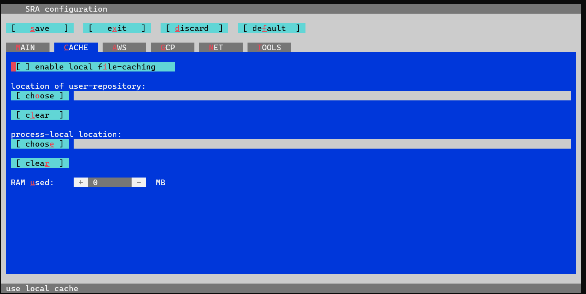
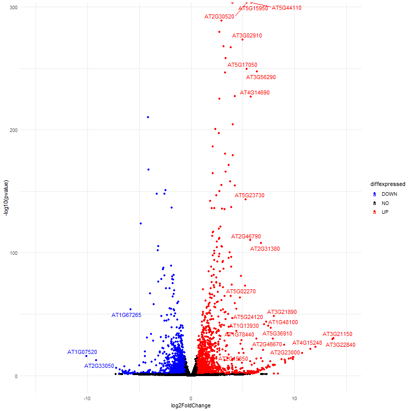

# Contenido:

- [Practica 1 - Analisis de calidad de las lecturas y limpieza de adaptadores](#practica1) - 21-22 Feb 2023
- [Practica 2 - Ensamblaje con el transcriptoma de referencia (kallisto)](#practica2) - 22 Feb 2023
- [Practica 3 - Expresión diferencial con DESeq2](#practica3) - 23 Feb 2023
- [Practica 4 - Análisis de terminos GO](#practica4) - 24 Feb 2023
- [Practica 5 - Keys](#practica5) - 24 Feb 2023

## Practica 1 - Analisis de calidad de las lecturas y limpieza de adaptadores  <a name="practica1"></a>

### 1) Analisis de calidad de las lecturas crudas (raw data)

```
screen -S SRAdata # guardar una sesion en screen

# Nota para screen:
# - screen -S nombre : Guardar tu sesion actual
# - screen -ls : Ver el ID de tus sesiones
# - screen -r ID : cargar tu sesion de screen 
# - Ctrl + a + d : Salir del screen
# - Ctrl + a + esc : scroll

qlogin
cd /mnt/Timina/bioinfoII/rnaseq/BioProject_2023/rawData
ls
```

```
Desgloce de carpetas:
|-Athaliana_Fe_def/           # PRJNA256121 ---> Proyecto 1
|-Athaliana_phosphate/        # PRJNA821620 ---> Proyecto 2
|-COVID_virus/                # PRJNA858106 ---> Proyecto 3
|-Homo_sapiens/               # PRJNA826506 ---> Proyecto 4
|-adapters
    |- TruSeq3-PE.fa          # adaptadores para paired-end
    |- TruSeq-SE.fa           # adaptadores para single-end
    |- readme.txt
|-SRAData_dow.sh              # Descarga de SRA
|-SRA_run.sge                 # Mandar como job al cluster
```

### Error 1

Para descargar achivos por cada USUARIO debes modificar lo siguiente:

```
module load sra/3.0.0
vdb-config -i # disable storage of cache in ~
```
Va a desplegar la siguiente pantalla, te puedes mover con las letras que salen ahi. 
1 ) Teclamos C, para ir **C**ACHE
2 ) Deshabilitamos [] enable local file-caching, tecleando i
3 ) Vamos a guardar el cambio, tecleando s
4 ) teclea o, de OK
5 ) para salir tecleamos x.



Este paso es basico e indispensable para que puedas usar las herramientas de SRA tools (modulo sra/3.0.0).

### Error 2

Cada usuario tiene permisos diferentes cuando crea un archivo. Los permisos pueden modificarse con *chmod*.

Los caracteres atribuidos a los permisos son:
- *r* : escritura (Read)
- *w* : lectura (Write)
- *x* : ejecución (eXecute)

|  permisos   |  pertenece  |
|-------------|-------------|
|  rwx------  | usuario     |
|  ---r-x---  | grupo       |
|  ------r-x  | otros       |


La representación octal de chmod es muy sencilla

- Lectura tiene el valor de 4
- Escritura tiene el valor de 2
- Ejecución tiene el valor de 1

|  permisos| valor | significado |
|-----|-----|-----------------------------------|
| rwx |  7  | Lectura, escritura y ejecución    |
| rw- |  6  | Lectura, escritura        |
| r-x |  5  | Lectura y ejecución       |
| r-- |  4  | Lectura               |
| -wx |  3  | Escritura y ejecución             |
| -w- |  2  | Escritura                         |
| --x |  1  | Ejecución             |
| --- |  0  | Sin permisos          |

Por lo tanto:

| Forma larga |  Forma Octal |
|------------------------|-----------|
|chmod u=rwx,g=rwx,o=rx  | chmod 775 | 
|chmod u=rwx,g=rx,o=     | chmod 760 |
|chmod u=rw,g=r,o=r      | chmod 644 |
|chmod u=rw,g=r,o=       | chmod 640 |
|chmod u=rw,go=          | chmod 600 |
|chmod u=rwx,go=         | chmod 700 |

Como no estamos en nigun grupos, todos estamos en "otros", recomiendo que cambien todo lo que generen con:

```
chmod 777 Archivo
```

### TAREA:

- 1) Copiar lo archivos SRAData_dow.sh y SRA_run.sge en tu carpeta (proyecto).

```
# /mnt/Timina/bioinfoII/rnaseq/BioProject_2023/rawData
cp SRAData_dow.sh  Athaliana_Fe_def
cp SRA_run.sge Athaliana_Fe_def
```

- 2) Editar el archivo TXT contenido en tu carpeta, agrega cada SRA que falta de tu PRJNA (bioProject). *TIP:* cada SRA va en cada renglon.

```
cd Athaliana_Fe_def

# Si vemos que contiene el archivo TX, vemos que solo hay 2 SRA
cat ./Athaliana_Fe_def/Athaliana_fastq.txt
SRR1524946
SRR1524938

# Falta agregar los demas en cada linea o reglon.
nano Athaliana_fastq.txt
```

- 3) Edita el archivo.sh para que se ejecute en tu carpeta y guarde la informacion. Ejemplo de como debe quedar el codigo:

```
cat SRA_Hs_dow.sh
# Descarga de datos
# PARTE 1.- Descargar SRA
# PARTE 2.- Cambio de SRA a Fastq
# USAGE= ./SRA_Hs_dow.sh
# sed -i 's/\r//' ./SRA_Hs_dow.sh

# AUTHOR: Evelia Lorena Coss Navarrete
# https://github.com/EveliaCoss

# Tip: Cambia las direcciones para cada proyecto

# PARTE 1.- Descargar SRA
prefetch --option-file ./human_fastq.txt -O ./data

# --option-file : archivo de entrada con cada SRA por renglon
# -O : salida

# PARTE 2.- Cambio de SRA a Fastq
fastq-dump --gzip --skip-technical --dumpbase --split-3 --clip --outdir ./data/ ./data/SRR*/*.sra

# --gzip : Descomprimir archivos comprimidos con .gz
# --skip-technical : Optener solo lecturas de cada replica biologica. No tecnicas.
# --dumpbase : Formato de las secuencias basada en espacios.
# --split-3 : Separar archivos dependiendo del SRA en single-end con *.fastq, si es paired-end con *_1.fastq y *_2.fastq
# --clip : Remover adaptadores de las lecturas
# --outdir : salida
```

- 4) Edita el archivo.sge para que puedas mandar el job de acuerdo a lo que necesitas.

```
cat SRA_Hs_run.sge
#!/bin/bash
#
# Use Current working directory
#$ -cwd
#
# Join stdout and stderr
#$ -j n
#
# Run job through bash shell
#$ -S /bin/bash
#
# You can edit the script since this line
#
# Your job name
#$ -N Hs2RawData
#
# Send an email after the job has finished
#$ -m e
#$ -M ccc@gmail.com
#
#
# If modules are needed, source modules environment (Do not delete the next line):
. /etc/profile.d/modules.sh
#
# Add any modules you might require:
module load sra/3.0.0
#
# Write your commands in the next line
./SRA_Hs_dow.sh
```

Agrega tu email para que te avise cuando termine: #$ -M ccc@gmail.com

NOTA: necesitas mas modulos debes agregarlos en el archivo.sge, si cambias el script tambien debes editar ese archivo.

- 5) Descarga los archivos SRA.

```
# no este en qlogin, tienes que estar en root
qsub SRA_Hs_run.sge
```

### Continuamos con la practica 

Vamos a hacer buenas practicas de bioinformatica, acomoda tu proyecto de la siguiente manera:

```
|-Athaliana_Fe_def/           # PRJNA256121
  |- data/                    # raw_data (fastq.gz)
  |- FastQC_rawData/              # Salida del analisis de FastQC
  
 # Tipo: mkdir FastQC_rawData
```

Posteriormente, vamos a iniciar el analisis de calidad de las lecturas crudas o sin procesar (raw data):

```
# ejemplo:
cd /mnt/Timina/bioinfoII/rnaseq/BioProject_2023/examples_class/At_BlueDark_example

# cargar module FastQC
qlogin
module load fastqc/0.11.3
fastqc ./data/*.fastq.gz -o ./FastQC_rawData
```

Para el reporte en MultiQC:

```
module load multiqc/1.5
multiqc ./FastQC_rawData -o ./FastQC_rawData
```

### 2) Limpieza de adaptadores

```
module load trimmomatic/0.33
mkdir data_trimmed

# Crear symlink
ln -s /mnt/Timina/bioinfoII/rnaseq/BioProject_2023/rawData/adapters/TruSeq3-PE.fa .
ln -s /mnt/Timina/bioinfoII/rnaseq/BioProject_2023/rawData/adapters/TruSeq-SE.fa .

# single-end
cd data
for i in *.fastq.gz;
do echo
trimmomatic SE -threads 2 -phred33 $i ../data_trimmed/"${i%.fastq}_trimmed.fastq.gz" ILLUMINACLIP:../TruSeq-SE.fa:2:30:10 LEADING:3 TRAILING:3 SLIDINGWINDOW:4:20 MINLEN:35
done

# paired-end
cd data
for i in *_1.fastq.gz;
do echo
trimmomatic PE -threads 8 -phred33 $i "${i%_1.fastq.gz}_2.fastq.gz" \
../data_trimmed/"${i%_1.fastq.gz}_1_trimmed.fastq.gz" ../data_trimmed/"${i%_1.fastq.gz}_1_unpaired.fastq.gz" \
../data_trimmed/"${i%_1.fastq.gz}_2_trimmed.fastq.gz" ../data_trimmed/"${i%_1.fastq.gz}_2_unpaired.fastq.gz" \
ILLUMINACLIP:../TruSeq3-PE.fa:2:30:10 LEADING:3 TRAILING:3 SLIDINGWINDOW:5:20 MINLEN:60
done

# Regresar
cd ../
```

Notas:

- Remove adapters (ILLUMINACLIP:TruSeq3-PE.fa:2:30:10)
- Remove leading low quality or N bases (below quality 3) (LEADING:3)
- Remove trailing low quality or N bases (below quality 3) (TRAILING:3)
- Scan the read with a 4-base wide sliding window, cutting when the average quality per base drops below 15 (SLIDINGWINDOW:4:15)
- Drop reads below the 36 bases long (MINLEN:36)

Description:

- ILLUMINACLIP: Cut adapter and other illumina-specific sequences from the read.
- SLIDINGWINDOW: Perform a sliding window trimming, cutting once the average quality within the window falls below a threshold.
- LEADING: Cut bases off the start of a read, if below a threshold quality
- TRAILING: Cut bases off the end of a read, if below a threshold quality
- CROP: Cut the read to a specified length
- HEADCROP: Cut the specified number of bases from the start of the read
- MINLEN: Drop the read if it is below a specified length
- TOPHRED33: Convert quality scores to Phred-33
- TOPHRED64: Convert quality scores to Phred-64

Nota = ASCII_33 contiene los simbolos # y $ mientras que ASCII_64 no los contiene.

### 3) Analisis de calidad de las lecturas sin adaptadores

```
mkdir FastQC_trimmed
fastqc ./data_trimmed/*trimmed.fastq.gz -o ./FastQC_trimmed

# Reporte en MultiQC
multiqc ./FastQC_trimmed -o ./FastQC_trimmed
```

### 4) Descarga de los archivos en tu computadora

```
rsync -rptuvl ecoss@dna.liigh.unam.mx:/mnt/Timina/bioinfoII/rnaseq/examples_class/At_BlueDark_example/multiqc_report.html . 
```

Subir archivos al cluster

```
rsync -av ./archivo ecoss@dna.liigh.unam.mx:/mnt/Timina/bioinfoII/rnaseq/
```


### 5) Mandar todo en un job

Necesitas un sh y un sge

Ejemplo:  FastQCTrimmed_dow.sh

```
#!/bin/bash

# USAGE= ./FastQCTrimmed_dow.sh
# sed -i 's/\r//' FastQCTrimmed_dow.sh

# AUTHOR: Evelia Lorena Coss Navarrete
# https://github.com/EveliaCoss

# /mnt/Citosina/amedina/ecoss/Class/data/rawData_fastq

# PARTE 1.- FastQC y multiQC
fastqc ./data/*.fastq.gz -o ./FastQC_rawData
multiqc ./FastQC_rawData -o ./FastQC_rawData

# PARTE 2.- Limpieza de adaptadores
# single-end
cd data
for i in *.fastq.gz;
do echo
trimmomatic SE -threads 2 -phred33 $i ../data_trimmed/"${i%.fastq}_trimmed.fastq.gz" ILLUMINACLIP:../TruSeq-SE.fa:2:30:10 LEADING:3 TRAILING:3 SLIDINGWINDOW:4:20 MINLEN:35
done

# PARTE 3.- FastQC y multiQC
cd ../
fastqc ./data_trimmed/*.fastq.gz -o ./FastQC_trimmed
# Reporte en MultiQC
multiqc ./FastQC_trimmed -o ./FastQC_trimmed
```

Ejemplo:  Trimmed_run.sge

```
#!/bin/bash
#
# Use Current working directory
#$ -cwd
#
# Join stdout and stderr
#$ -j n
#
# Run job through bash shell
#$ -S /bin/bash
#
# You can edit the script since this line
#
# Your job name
#$ -N Trimmed_SRA_Arabidopsis
#
# Send an email after the job has finished
#$ -m e
#$ -M ecossnav@gmail.com
#
#
# If modules are needed, source modules environment (Do not delete the next line):
. /etc/profile.d/modules.sh
#
# Add any modules you might require:
module load fastqc/0.11.3
module load multiqc/1.5
module load trimmomatic/0.33
#
# Write your commands in the next line
./FastQCTrimmed_dow.sh
```

Nota: recuerda cambiar los permisos `chmod 777 Archivos`

### Referencias

[Cambio de permisos](https://blog.desdelinux.net/permisos-basicos-en-gnulinux-con-chmod/?_gl=1%2A2y07vi%2A_ga%2AYW1wLUdoUlFla2VDM1RfdGlkMlJaYk1XRF9MRlkzSVcxeWx4eDZ5VzExRTlSX092bmFPdUgzTUZrYUhTUUhDRnRuX2c)

## Practica 2 - Ensamblaje con el transcriptoma de referencia (Kallisto) <a name="practica2"></a>

Transcriptomas empleados en este ejemplo: 

- **BioProject:** [PRJNA263310](https://www.ncbi.nlm.nih.gov/bioproject/PRJNA263310)
- **Numero de transcriptomas:** 6 transcriptomas 
- **Tipo de bibliotecas:** *Single-end*
- **Metodo de seleccion:** oligo dT / polyA
- **Secuenciador:** Illumina HiSeq 2000
- **Distribucion de las muestras:** 
    * Control (Dark) - SRR1606325 (repbio1), SRR1608973 (repbio2) y SRR1608977 (repbio3).	
    * Tratamiento de Luz azul (Blue) - SRR1609063 (repbio1), SRR1609064 (repbio2) y SRR1609065 (repbio3).

### 1) Necesitas un transcriptoma de referencia

A) Puedes descargarlo de alguna base de datos

*Homo sapiens*

```
# /mnt/Timina/bioinfoII/rnaseq/BioProject_2023/examples_class/
# wget https://ftp.ebi.ac.uk/pub/databases/gencode/Gencode_mouse/release_M28/gencode.vM28.transcripts.fa.gz # raton
# correccion
wget https://ftp.ebi.ac.uk/pub/databases/gencode/Gencode_human/release_43/gencode.v43.transcripts.fa.gz # humano
```

B) Puedes generarlo

En este paso necesitas hacer alineamiento y ensamblaje con el genoma de referenia.

STAR --> Stringtie --> At_stringm_seq_v2.fasta

Este transcriptoma lo genere a partir de 254 transcriptomas.

*Arabidopsis thaliana*

```
# /mnt/s/Repositorio_scripts/Intersect_lncRNAs/original_FASTA_files
# Cargar archivos
rsync -av ./At_stringm_seq_v2.fasta
ecoss@dna.liigh.unam.mx:/mnt/Timina/bioinfoII/rnaseq/BioProject_2023/examples_class/At_BlueDark_example/
```

**Nota:** Para emplear estos archivos pueden usar symlink. (ln -s /Ruta/Completa /Ruta/WORK).

```
# Homo sapiens
ln -s /mnt/Timina/bioinfoII/rnaseq/BioProject_2023/examples_class/Human_cells_example/gencode.v43.transcripts.fa.gz . 

# Arabidopsis thaliana
ln -s /mnt/Timina/bioinfoII/rnaseq/BioProject_2023/examples_class/At_BlueDark_example/At_stringm_seq_v2.fasta .
```

### 2) Generar el index de Kallisto

```
mkdir kallisto_quant

# Generar index de kallisto
module load kallisto/0.45.0 # cargar modulo de kallisto
kallisto index -i ./kallisto_quant/At_ref.kidx At_stringm_seq_v2.fasta
```

* -i nombre del archivo de salida, i.e., indice
* Input =  At_stringm_seq_v2.fasta, transcriptoma de referencia

### 3) Pseudoalineamiento con Kallisto

```
# Single-end
for file in ./data_trimmed/*trimmed.fq.gz
do
  clean=$(echo $file | sed 's/^.\{15\}//g;s/_trimmed//;s/\.fastq\.gz//;s/\.fq\.gz//')   # Nombre de la carpeta de salida, mismo nombre de SRA
  kallisto quant --index ./kallisto_quant/At_ref.kidx --output-dir ./kallisto_quant/${clean} --single -l 200 -s 20  --threads=12 $file
done

# Nota: Debes poner --single -l -s, obligatorio.


# Paired-end
for file in ./data_trimmed/*_1.fastq.gz                                                         # Read1
do
  clean=$(echo $file | sed 's/^.\{15\}//g;s/_trimmed//;s/\.fastq\.gz//;s/_1\.fq\.gz//')         # Nombre de la carpeta de salida, mismo nombre de SRA
  file_2=$(echo ${clean}_2.fastq.gz| sed 's/FP/RP/')                                            # Read2
  kallisto quant --index ./kallisto_quant/At_ref.kidx --output-dir ./kallisto_quant/${clean} --threads 12 ${file} ${file_2}
done
```

### 4) Mandar todo en un job

Podemos poner todo en un solo sge.

```
#!/bin/bash
#
# Use Current working directory
#$ -cwd
#
# Join stdout and stderr
#$ -j n
#
# Run job through bash shell
#$ -S /bin/bash
#
# You can edit the script since this line
#
# Your job name
#$ -N Kallisto_example
#
# Send an email after the job has finished
#$ -m e
#$ -M ccc@gmail.com
#
#
# If modules are needed, source modules environment (Do not delete the next line):
. /etc/profile.d/modules.sh
#
# Add any modules you might require:
module load kallisto/0.45.0
#
# Write your commands in the next line

# Generar index de kallisto
kallisto index -i ./kallisto_quant/At_ref.kidx At_stringm_seq_v2.fasta

# - i nombre del archivo de salida, i.e., indice
#- Input =  At_stringm_seq_v2.fasta, transcriptoma de referencia

# Single-end
for file in ./data_trimmed/*trimmed.fq.gz
do
  clean=$(echo $file | sed 's/^.\{15\}//g;s/_trimmed//;s/\.fastq\.gz//;s/\.fq\.gz//')   # Nombre de la carpeta de salida, mismo nombre de SRA
  kallisto quant --index ./kallisto_quant/At_ref.kidx --output-dir ./kallisto_quant/${clean} --single -l 200 -s 20  --threads=12 $file
done

```

* -l 200 : mean = 200
* -s 20 : sd = 20

### 5) Output de trabajo

#### Cuando se genera el indice se obtiene esta salida:

```
cat Kallisto_AtB.e272267

[build] loading fasta file At_stringm_seq_v2.fasta
[build] k-mer length: 31
[build] warning: clipped off poly-A tail (longer than 10)
        from 125 target sequences
[build] warning: replaced 779 non-ACGUT characters in the input sequence
        with pseudorandom nucleotides
[build] counting k-mers ... done.
[build] building target de Bruijn graph ...  done
[build] creating equivalence classes ...  done
[build] target de Bruijn graph has 431334 contigs and contains 58023203 k-mers
```

#### Cuando se hace el pseudoalineamiento con el conteo tenemos esta salida:

```
cat Kallisto_AtB.e272267

[quant] fragment length distribution is truncated gaussian with mean = 200, sd = 20
[index] k-mer length: 31
[index] number of targets: 81,630
[index] number of k-mers: 58,023,203
[index] number of equivalence classes: 220,711
[quant] running in single-end mode
[quant] will process file 1: ./data_trimmed/SRR1606325.fastq.gz_trimmed.fq.gz
[quant] finding pseudoalignments for the reads ... done
[quant] processed 35,652,173 reads, 27,944,704 reads pseudoaligned
[   em] quantifying the abundances ... done
[   em] the Expectation-Maximization algorithm ran for 1,186 rounds


[quant] fragment length distribution is truncated gaussian with mean = 200, sd = 20
[index] k-mer length: 31
[index] number of targets: 81,630
[index] number of k-mers: 58,023,203
[index] number of equivalence classes: 220,711
[quant] running in single-end mode
[quant] will process file 1: ./data_trimmed/SRR1608973.fastq.gz_trimmed.fq.gz
[quant] finding pseudoalignments for the reads ... done
[quant] processed 34,164,384 reads, 25,854,250 reads pseudoaligned
[   em] quantifying the abundances ... done
[   em] the Expectation-Maximization algorithm ran for 1,136 rounds
```

### 6) Errores en Kallisto

Debes poner --single -l -s, si no sale este error:

```
Error: fragment length mean and sd must be supplied for single-end reads using -l and -s
```

### 7) Como sabemos que ya termino:

```
ls kallisto_quant/*
kallisto_quant/At_ref.kidx

kallisto_quant/SRR1606325:
abundance.h5  abundance.tsv  run_info.json

kallisto_quant/SRR1608973:
abundance.h5  abundance.tsv  run_info.json

kallisto_quant/SRR1608977:
abundance.h5  abundance.tsv  run_info.json

kallisto_quant/SRR1609063:
abundance.h5  abundance.tsv  run_info.json

kallisto_quant/SRR1609064:
abundance.h5  abundance.tsv  run_info.json

kallisto_quant/SRR1609065:
abundance.h5  abundance.tsv  run_info.json
```

### 8) Descarga de los archivos en tu computadora

```
# Descagar resultados de kallisto
rsync -rptuvl ecoss@dna.liigh.unam.mx:/mnt/Timina/bioinfoII/rnaseq/BioProject_2023/examples_class/At_BlueDark_example/kallisto_quant/SRR* . 

# tx2gene
rsync -rptuvl ecoss@dna.liigh.unam.mx:/mnt/Timina/bioinfoII/rnaseq/BioProject_2023/examples_class/At_BlueDark_example/At_all_genes_tx2gene.csv . 
```

## Practica 3 - Expresión diferencial con DESeq2 <a name="practica3"></a>

Abrir RStudio y cargar los siguientes paquetes

```
library(tximport)
library(tidyverse)
library(DESeq2)
library(ggplot2)
library(ggrepel) # libreria que evita el overlap de texto en labels
```

Importacion de datos de kallisto en R

```
# > A. thaliana
# generar tabla de metadatos
At_metadata.tsv <- data.frame("SRA" =c("SRR1606325","SRR1608973", "SRR1608977", "SRR1609063", "SRR1609064",
                                          "SRR1609065"), "sample" = c("control_R1","control_R2","control_R3", "luz_azul_R1", "luz_azul_R2", "luz_azul_R3") , "dex" = c(rep("control",3), rep("luz_azul",3)), "species" = "Arabidopsis_thaliana")

# Anotacion articulo
# Cargar los archivos por nombre del archivo (ubicacion empleando la anotacion de los 224 transcriptomas) 
At_samples <- At_metadata.tsv
At_files   <- file.path("./Kallisto_example_R", At_samples$SRA,"abundance.tsv")
names(At_files) <- At_samples$SRA

# Empleando la misma anotacion del articulo
# previamente generado con clusterBED y R
At_tx2gene   <- read.csv("At_all_genes_tx2gene.csv", sep=",",header=TRUE) 
#tr2gn <- data.frame("gene_id"= tx2gene$geneID, "transcript_id" = tx2gene$transcriptID)
At_txi_kallisto <- tximport(At_files, type = "kallisto", tx2gene=At_tx2gene)
# Default = txIn = TRUE, txOut = FALSE, countsFromAbundance = "no"

# nombre de los transcriptomas
rownames(At_samples) <- At_samples$sample
colnames(At_txi_kallisto$counts) <-rownames(At_samples) 

# Que contiene el archivo?
 names(At_txi_kallisto)

# Importacion de los datos convirtiendolos en un objeto que puede leer Deseq.
At_ddsTxi_all       <- DESeqDataSetFromTximport(At_txi_kallisto, At_samples, design = ~ dex) # Create a DESeq object from the tximport data

# Prefiltrado, eliminacion de genes con bajas cuentas
keep                <- rowSums(counts(At_ddsTxi_all)) >= 10
At_ddsTxi_all       <- At_ddsTxi_all[keep,] 
At_dds_all          <- DESeq(At_ddsTxi_all) # run Differential expression analysis 
```

### A) Cuentas normalizadas para graficas (rlog)

```
At_all_normalized <- rlog(At_dds_all, blind=FALSE) # result rld, vst
At_all_normalized_db <- as.data.frame(assay(At_all_normalized))
head(At_all_normalized_db)
```
PCA

```
plotPCA(At_all_normalized, intgroup=c("dex"))
```

### B) Expresion diferencial (TODOS LOS TRANSCRITOS)

```
At_res_all                              <- results(At_dds_all)  # Save the results
mcols(At_res_all)$description # contraste shoot vs root
#https://github.com/COMBINE-lab/salmon/issues/581

# extraer UP
At_all_de_gene_matrix_UP  <- subset(At_res_all, padj < 0.05 & log2FoldChange >= 0.5)
write.table(At_all_de_gene_matrix_UP,file ="./At_all_DEG_kallisto_BlueLight.tsv", quote=FALSE, sep="\t")
# Extraer nombres
At_all_de_gene_names_UP <- rownames(At_all_de_gene_matrix_UP)

# extraer down genes
At_all_de_gene_matrix_DOWN  <- subset(At_res_all, padj < 0.05 & log2FoldChange < -0.5)
write.table(At_all_de_gene_matrix_DOWN,file ="./At_all_DEG_kallisto_Control.tsv", quote=FALSE, sep="\t")
# Extraer nombres
At_all_de_gene_names_DOWN <- rownames(At_all_de_gene_matrix_DOWN)

# Numero de genes expresados
length(At_all_de_gene_names_UP)
length(At_all_de_gene_names_DOWN)
```

#### C) volcano plot

```
At_de <- as.data.frame(At_res_all)
# add a column of NAs
At_de$diffexpressed <- "NO"

# if log2Foldchange > 0.6 and pvalue < 0.05, set as "UP" 
At_de$diffexpressed[At_de$log2FoldChange > 0.6 & At_de$pvalue < 0.05] <- "UP"
# if log2Foldchange < -0.6 and pvalue < 0.05, set as "DOWN"
At_de$diffexpressed[At_de$log2FoldChange < -0.6 & At_de$pvalue < 0.05] <- "DOWN"
# Create a new column "names" to de, that will contain the name of a subset if genes differentially expressed (NA in case they are not)
At_de$names <- NA
# filter for a subset of interesting genes
filter <- which(At_de$diffexpressed != "NO" & At_de$padj < 0.05 & (At_de$log2FoldChange >= 5  | At_de$log2FoldChange <= -5))
At_de$names[filter] <- rownames(At_de)[filter]

# grafica
png(file = "volcano05-res.png",
    width = 800, height = 800) # guardar el plot en formato png
ggplot(data=At_de, aes(x=log2FoldChange, y=-log10(pvalue), col=diffexpressed, label=names)) +
    geom_point() +
    scale_color_manual(values=c("blue", "black", "red")) + # cambiar colores de puntos
    theme_minimal() +
    geom_text_repel() +
    xlim(-15,15)

dev.off()
```



#### D) Heatmap

```
library("pheatmap")
# los primeros 20 genes
select <- order(rowMeans(counts(At_dds_all,normalized=TRUE)),
                decreasing=TRUE)[1:20]
df <- as.data.frame(colData(At_dds_all)[,c("dex", "sample")])

#heatmap
pheatmap(assay(At_all_normalized)[select,], cluster_rows=FALSE, show_rownames=FALSE,
         cluster_cols=FALSE, annotation_col=df)
```

## Practica 4 - Análisis de terminos GO <a name="practica4"></a>

### 1) Obtener la base de datos de la especie

#### Extraer informacion de la base de datos

```
#Bases de datos contenidas en ensembl plant
library(biomaRt)
listMarts(host="plants.ensembl.org")

# hongos-David
listMarts(host="ensembl.org")

#Lista de especies contenidas
plant_ensembl <- useEnsembl(biomart="plants_mart", host ="plants.ensembl.org" )
head(listDatasets(plant_ensembl))

# todos lo que contiene enssembl
all_ensembl <- useEnsembl(biomart="ensembl")
head(listDatasets(all_ensembl))

# Para ver todas las bases de datos contenidas en Ensembl
View(listDatasets(all_ensembl))
```

- Arabidopsis thaliana  = `athaliana_eg_gene`
- Homo sapiens = `hsapiens_gene_ensembl`

#### Extraer base de datos de Arabidopsis

```
athaliana_database <- useMart(biomart = "plants_mart", host = "plants.ensembl.org", dataset = "athaliana_eg_gene")
head(listFilters(athaliana_database))
head(listAttributes(athaliana_database))
```

#### Extraer biotipos de genes

En esta seccion se extraen los id de los genes pertenecientes a las categorias: **ncRNAs, snoRNAs, snRNAs, tRNA, rRNA, lncRNA, protein-coding, pre-miRNAs**, etc.

```
# Arabidopsis thaliana
athaliana_biotype_genes <- getBM(c("ensembl_gene_id","gene_biotype"), mart=athaliana_database)

# Homo sapiens
hsapiens_database <- useMart(biomart = "ENSEMBL_MART_ENSEMBL", host = "ensembl.org", dataset = "hsapiens_gene_ensembl")

unique(athaliana_biotype_genes$gene_biotype)
```

### 2) Analisis de terminos GO

#### Obtener todos los terminos GO anotados en la especie

```
library(topGO)
#BiocManager::install("topGO")
# Extraer los terminos GO
At_GOgenes <- getBM(attributes=c('ensembl_gene_id', 'go_id'), mart=athaliana_database)

head(At_GOgenes)

# Guardamos la lista de genes un archivo tsv.
write.table(At_GOgenes, file = "./At_geneid2go.map",sep = "\t", row.names = FALSE, col.names = FALSE, quote = FALSE)
```

Se empleo la funcion **getBM** para filtrar los datos previamente recolectados de Ensembl Plant con la paqueteria **biomaRT**. Ademas, lso datos se guardaron en forma de lista para ser procesados posteriormente por **TopGO (ENSEMBL)**.

#### Conversion de Ensembl IDs a Entrez IDs y Obtener Universo

```
# > Universo
# Despues de esto la podemos leer y transformarla al formato necesario para poder usarla como base de datos por topGO
At_geneID2GO <- readMappings("./At_geneid2go.map")
str(head(At_geneID2GO))

# Obtener nombre de los genes de GO a gene ID
GO2geneID <- inverseList(At_geneID2GO)
str(head(GO2geneID))

# Se tiene que modificar la lista de genes para que pueda ser utilizada por topGO
At_geneNames <- names(At_geneID2GO) # universo
head(At_geneNames)
```

#### Obtener terminos GO de los DEG

```
#---------------### A) Matriz binaria ---------------------------------
# > Luz azul
At_gene.names.up.go <- unlist(strsplit(At_all_de_gene_names_UP, split = "|", fixed = TRUE))
At_geneList.up <- factor(as.integer(At_geneNames %in% At_all_de_gene_names_UP))
names(At_geneList.up) <- At_geneNames
head(At_geneList.up)
str(At_geneList.up)

# > Control
At_gene.names.down.go <- unlist(strsplit(At_all_de_gene_names_DOWN, split = "|", fixed = TRUE))
At_geneList.down <- factor(as.integer(At_geneNames %in% At_all_de_gene_names_DOWN))
names(At_geneList.down) <- At_geneNames
head(At_geneList.down)

#---------------### B) Obtencion de terminos GO---------------------------------
# > Luz azul
# Despues de esto y con la lista de genes previamente identificados podemos generar un objeto GO.
At_GOdata.up <- new("topGOdata", ontology = "BP", allGenes = At_geneList.up, 
              annot = annFUN.gene2GO, gene2GO= At_geneID2GO)
At_GOdata.up

#Numero de genes
numGenes(At_GOdata.up)

# > Control
At_GOdata.down <- new("topGOdata", ontology = "BP", allGenes = At_geneList.down, 
              annot = annFUN.gene2GO, gene2GO= At_geneID2GO)
At_GOdata.down

#Numero de genes
numGenes(At_GOdata.down)

#------------### C) Prueba de Fisher-------------------------------
# > Parte aerea
At_resultsFisher.up <- runTest(At_GOdata.up, algorithm = "classic", statistic = "fisher")
At_resultsFisher.up

#> Raices
At_resultsFisher.down <- runTest(At_GOdata.down, algorithm = "classic", statistic = "fisher")
At_resultsFisher.down

#Nombre de los genes
At_Blue_a <- genes(At_GOdata.up)
#At_shoot_a
At_Control_a <- genes(At_GOdata.down)

# una muestra de genes mas interesantes
At_blue_selGenes <- sample(At_Blue_a, 10) 
At_blue_gs <- geneScore(At_GOdata.up, whichGenes = At_blue_selGenes)

At_Control_selGenes <- sample(At_Control_a, 10) 
At_Control_gs <- geneScore(At_GOdata.down, whichGenes = At_Control_selGenes)

# > Muestra de genes anotados
sg <- sigGenes(At_GOdata.up)
str(sg)

# Numero de genes anotados
numSigGenes(At_GOdata.up) # 22850 genes con terminos GO en shoot
numSigGenes(At_GOdata.down) #22512 genes con terminos GO en root

# ----------------Top 10 numero de genes encontrados en los GO----------
sel.terms <- sample(usedGO(At_GOdata.up), 10)
num.ann.genes <- countGenesInTerm(At_GOdata.up, sel.terms) ## the number of annotated genes
num.ann.genes

ann.genes <- genesInTerm(At_GOdata.up, sel.terms) ## get the annotations
head(ann.genes)

# estadistico
termStat(At_GOdata.up, sel.terms)
```

Seleccion por pvalue de la prueba de fisher

```
# > Terminos GO encontrados en la blue light (up)
# Summary de todos los resultados. 
At_blue.table <- GenTable(At_GOdata.up, classicFisher = At_resultsFisher.up,
         orderBy = "classicFisher", ranksOf = "classicFisher", topNodes = 10)

# corregir de chr a num en classicFisher
At_blue.table$classicFisher <- as.numeric(At_blue.table$classicFisher)

# Filtrado
At_blueGO <- as.data.frame(At_blue.table[At_blue.table$classicFisher <= 0.05,])
At_blueGO
str(At_blueGO)
dim(At_blueGO)

# >Terminos GO encontrados en el control (down)
# Summary de todos los resultados. 
At_control.table <- GenTable(At_GOdata.down, classicFisher = At_resultsFisher.down,
         orderBy = "classicFisher", ranksOf = "classicFisher", topNodes = 10)


showGroupDensity(At_GOdata.down, "GO:0010015", ranks = FALSE, rm.one = FALSE)

# corregir de chr a num en classicFisher
At_control.table$classicFisher <- as.numeric(At_control.table$classicFisher)

At_controlGO <- as.data.frame(At_control.table[At_control.table$classicFisher <= 0.05,])
At_controlGO
str(At_controlGO)
dim(At_controlGO)
```

Con **topNodes**  puedes indicar el numero de terminos globales que quieres.


#### Grafica

```
# Reducir informacion
#blue
At_blue_visualplot <- At_blueGO[,c(1,2,3,6)] #col ID, term, annotated and classicFisher
head(At_blue_visualplot)
dim(At_blue_visualplot)

#control
At_control_visualplot <- At_controlGO[,c(1,2,3,6)]
head(At_control_visualplot)
dim(At_control_visualplot)

# Grafica
library(ggplot2)
library(dplyr)

#conversion de chr a num
At_blue_visualplot$classicFisher <- as.numeric(At_blue_visualplot$classicFisher)
str(At_blue_visualplot)
At_blue_visualplot$dex <- "blue"

At_control_visualplot$classicFisher <- as.numeric(At_control_visualplot$classicFisher)
str(At_control_visualplot)
At_control_visualplot$dex <- "control"

# unir ambos datos
At_treatment_visualplot <- rbind(At_blue_visualplot, At_control_visualplot)
colnames(At_treatment_visualplot) <- c("GO.ID", "Term", "Annotated", "padjust", "dex")
# Orden
At_treatment_visualplot <-At_treatment_visualplot[order(At_treatment_visualplot$Annotated, decreasing = T), ]

# Fig 1- Nuestros primeros pasos
At_treatment_visualplot %>% ggplot(aes(x=dex, y = Term, size= Annotated, color =padjust)) + geom_point(alpha=1.0) +
  scale_color_gradient(low="blue", high="red") +
  labs(title = "Enriquecimiento de terminos GO (all)", #GO Biological processes
       x = "A.thaliana", y = "",
      caption = 'Cut-off of padj=0.05') + # agregar x y y label
  theme_light() +
  theme(text = element_text(size=12, family="sans"), 
        axis.title.x = element_text(face = "italic",  family="sans")) # controlar label x

# classicFisher = p.adjust
# Annotated = Count

# Fig 2 - Numero de genes por Go term
At_treatment_visualplot %>% ggplot(aes(x=Annotated, y = reorder(Term, Annotated), fill=dex)) + 
  geom_bar(stat = "identity") +
  geom_text(
        aes(label = Annotated), # Agregar informacion en numeros
        color = "black",
        size = 4,
        hjust=0.5,
        position = position_dodge(0.9)) +
  scale_fill_manual(values=c("blue", "gray")) +#colores de relleno, cafe y verde (root and shoot)
  facet_wrap(~dex, scales="free") +
  labs(title = "Enriquecimiento de terminos GO (all)", #GO Biological processes
       x = "A.thaliana", y = "",
      caption = 'Cut-off of padj=0.05') + # agregar x y y label
  theme_classic()+
  theme(text = element_text(size=12, family="sans"), 
        axis.title.x = element_text(face = "italic",  family="sans"),# controlar label x
        legend.position = "none", 
        legend.title = element_blank(), 
        strip.background = element_blank()) 
```


## Practica 5 - Keys <a name="practica5"></a>

Solo en la clase presecial. Correcto uso de keys para el cluster.
Ya no necesitaras poner tu password.


